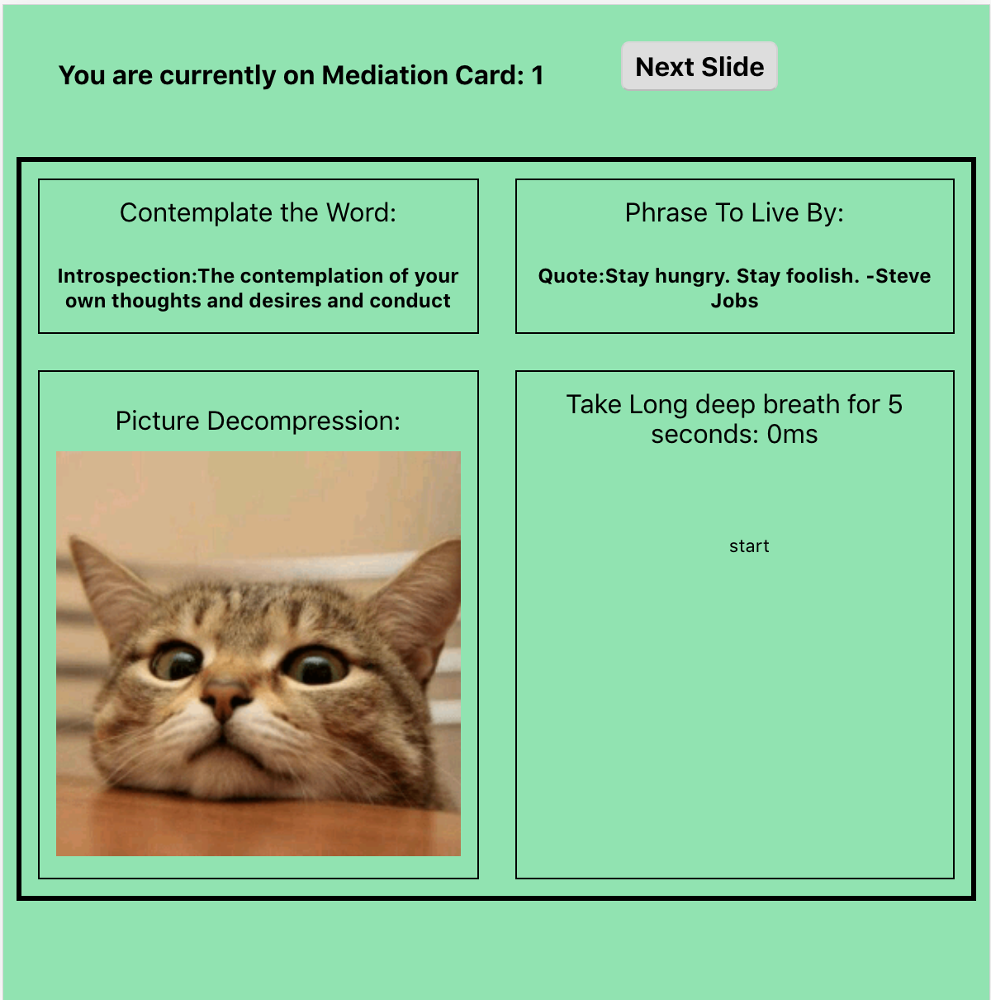
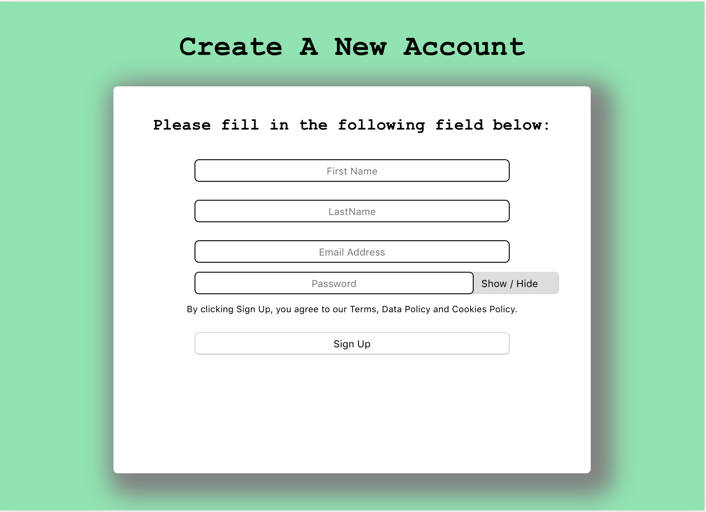

# **_Motivate The Mind_**

**Check-Out the website at:**
[Motivate The Mind](https://tchang46343-coeus-app.now.sh/).

For access to the API repo of Coeus System Inc. click on [Motivate The Mind](https://github.com/tchang46343/mindgame-app.git).

## Motivate The Mind Summary:

Take a break, relax, and enjoy the game. Motivate the Mind is a mental health game website. A user will be shown a series of slides in which the game is designed to alleviate stress and promote positivity. As mental health is often overlooked, individuals should take more care of their mental health state. Having a clearer mental health state provides many benefits such as better memory retention, reduce anxiety, lower blood pressure, and increase energy. By playing Motivate the Mind, users should feel refreshed and empower after one round of slides. So remember, taking care of your mental health, and don't let it be the last thing on your mind.

# **Application Screenshots**

## Home Page:

- The image above is the landing page for Motivate The Mind.
- To get started read the instructions on how to play the game and Click "Begin Game" when you are ready.
- On the first page of the game you will see four boxes. View all four boxes and interpret the message that ressonance with you. Next click on the "Next" button until you are taken to the end of the game.

## Game Card:

- The card above is displayed in four quadrants. The idea of the four quadrants allows the user eyes to focus on any particular area. The idea is to examine each quadrant and let your mind taking into the meaning of each section. Some images maybe be funny and relaxing, or some quote may give a sense of empowerment, and even the timer exercise serves the purpose of lowering your heart and allows the user to settle down.

## Create Account:

- This screen shot demonstrates the ability to create a profile. Users can create a profile and interact with other users once profile has been created

* ### Add Inventory Items:

- This screen shot demonstrates the ability for the customer to post new inventory items to the database.
- As seen in the example data was entered into the required fields and then the server sent a fetch request to POST the data.

## Technology Languages Used:

- HTML5
- CSS3
- Javascript
- React
